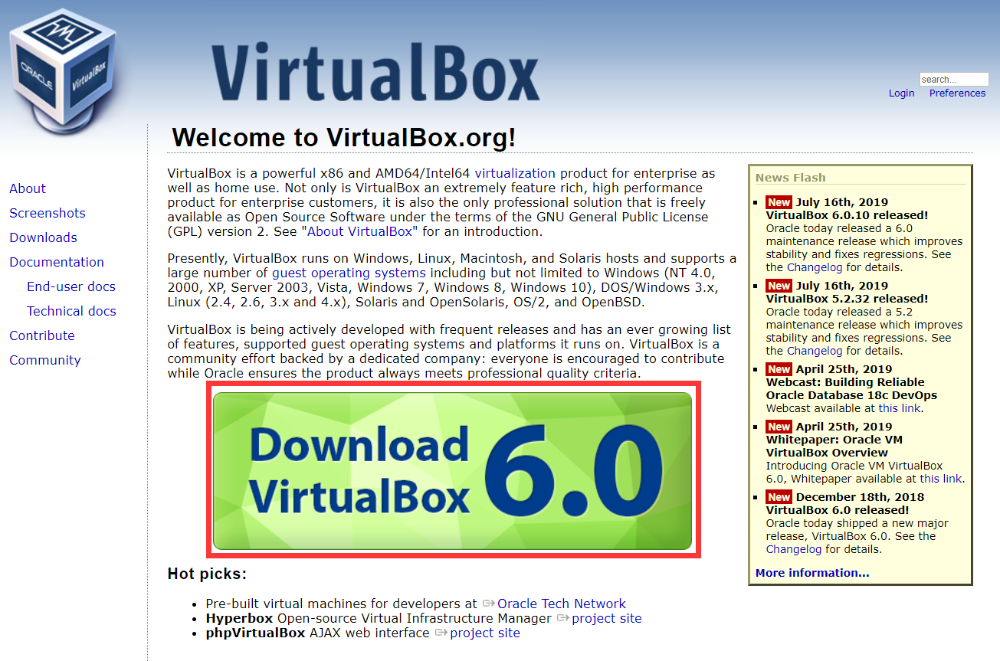

# 安装配置你的私有云，让你的计算机也能提供云桌面服务

本文总阅读量 : 
## 一、实验目的
1. 初步了解虚拟化技术，理解云计算的相关概念  
2. 理解系统工程师面临的困境
3. 理解自动化安装、管理（DevOps）在云应用中的重要性
## 二、实验环境与要求
 实验需要硬件虚拟化（AMD-V 或 Intel-VT）支持，部分旧笔记本不支持。
 - 用户通过互联网，使用微软远程桌面，远程访问你在PC机上创建的虚拟机
 - 虚拟机操作系统 Centos，Ubuntu，或 你喜欢的 Linux 发行版，能使用 NAT 访问外网。
## 三、实验内容具体步骤
1. 安装Virtual Box
 - 通过[官方下载地址](https://www.virtualbox.org/)点击下载，之后按照安装程序步骤点击下一步直到完成即可。

