# 安装配置你的私有云，让你的计算机也能提供云桌面服务
<script async src="//busuanzi.ibruce.info/busuanzi/2.3/busuanzi.pure.mini.js"></script>
<span id="busuanzi_container_page_pv">本文总阅读量 : <span id="busuanzi_value_page_pv"></span></span>
## 一、实验目的
1. 初步了解虚拟化技术，理解云计算的相关概念  
2. 理解系统工程师面临的困境
3. 理解自动化安装、管理（DevOps）在云应用中的重要性

## 二、实验环境与要求
 实验需要硬件虚拟化（AMD-V 或 Intel-VT）支持，部分旧笔记本不支持。
 - 用户通过互联网，使用微软远程桌面，远程访问你在PC机上创建的虚拟机
 - 虚拟机操作系统 Centos，Ubuntu，或 你喜欢的 Linux 发行版，能使用 NAT 访问外网。

## 三、实验内容
### 1. 安装Virtual Box
- 通过[官方下载地址](https://www.virtualbox.org/)点击下载，之后按照安装程序步骤点击下一步直到完成即可。
- 配置VirtualBox虚拟机存储位置，避免找不到虚拟机存储位置，特别是消耗启动盘的宝贵空间。VirtualBox`管理`->`全局设定`->`常规`
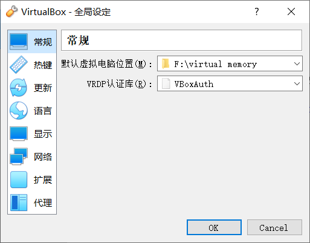
- 创建虚拟机虚拟网络，使得Vbox内部虚拟机可以通过它，实现虚拟机之间，虚拟机与主机的通讯
    - VirtualBox`管理`->`主机网络管理器`->`创建`，如图网址分配：
    IPv4地址：192.168.100.1；网络掩码：255.255.255.0
    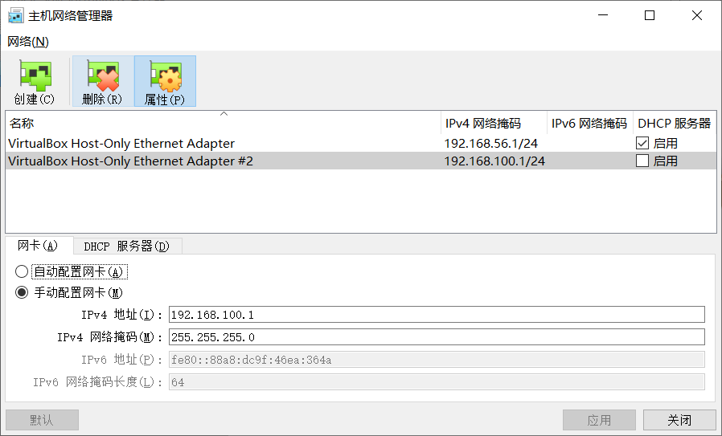
    - 在主机windows命令行窗口输入`ipconfig`,可以看到`以太网适配器 VirtualBox Host-Only Network #2:`，如下图
    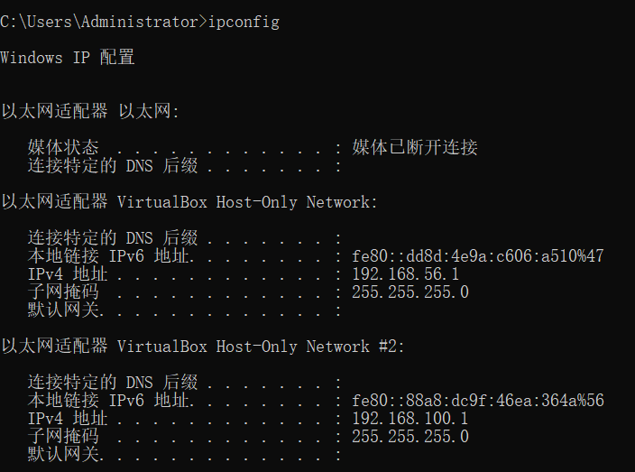

### 2. 创建Linux虚拟机（以CentOS为例）
- 下载Linux发行版镜像，CentOS通过[下载地址](https://www.centos.org/download/)下载 **Minimal ISO** 
- 用VirtualBox创建虚拟机，名称为 **CentOS-base**
    - 内存（RAM）：2G
    - 显示：默认设置
    - 存储（ROM）：40G
    - 网络：第一块网卡为`NAT`，第二块网卡为`Host-Only`，接口是前面创建的虚拟网卡
     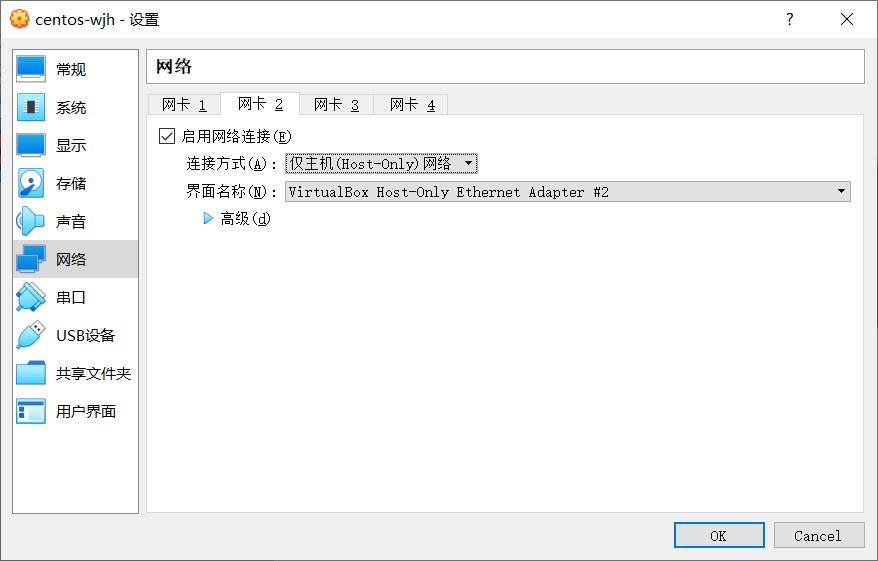
- 安装base虚拟机
    - 点击启动后按提示完成安装即可
    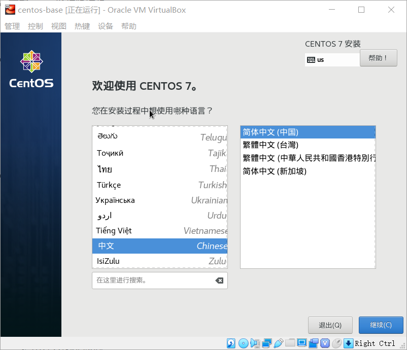
    - 升级OS系统内核
        - 获取wget，`yum install wget`
        - 配置源为```阿里云源```
            1. 备份`/etc/yum.repos.d/CentOS-Base.repo`文件
            ```
            cd /etc/yum.repos.d/
            mv CentOS-Base.repo CentOS-Base.repo.back
            ```
            2. 下载阿里云的CenOS-7.repo文件
            `wget -O CentOS-Base.repo http://mirrors.aliyun.com/repo/Centos-6.repo `
            3.  重新加载yum
            ```
            yum clean all
            yum makecache
            ```
        - 升级OS内核 `yum update`
    - 检查网卡配置
        - 配置网络的UI界面 `nmtui`，配置第二块网卡地址，地址为`192.168.100.1`
        - 尝试ping外网`www.baidu.com`，成功如下
       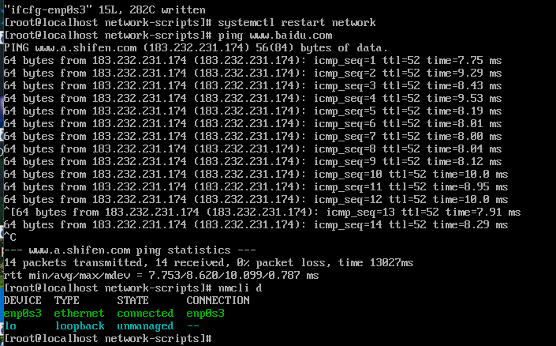
    - 退出并关闭虚拟机
- 安装虚拟机
    - 点击`CentOS-base`选择`复制`，输入新虚拟机的名字，注意选择 **重新初始化所有网络卡的MAC地址** 和 **链接复制**
    - 同上面的步骤使用`nmtui`配置主机名和第二块网卡ip地址，重启
    - 在主机上用git bash能够ping通`192.168.100.1`
    
- 安装vim `yum install vim`
- 安装CentOS桌面
    - 安装桌面
    `yum groupinstall "GNOME Desktop"`
    - 设置启动目标为桌面
    `ln -sf /lib/systemd/system/runlevel5.target /etc/systemd/system/default.target`
    - 重启
- 安装VirtualBox增强功能
[VirtualBox虚拟机CentOS安装增强功能Guest Additions](https://www.jianshu.com/p/7c556c783bb2)
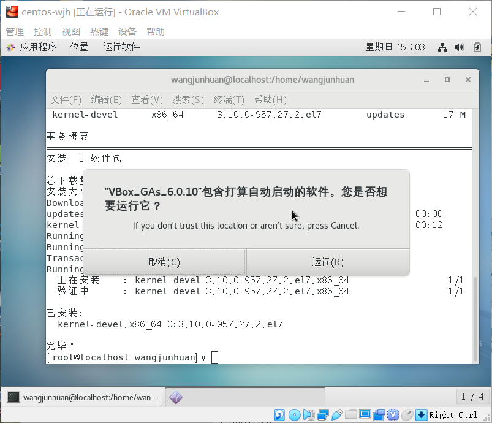
- 安装Chrome浏览器
[CentOS7下安装google chrome浏览器](https://blog.csdn.net/u010454261/article/details/52833045)
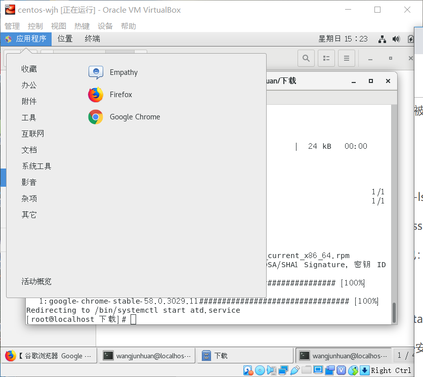
### 3. 配置用远程桌面访问你的虚拟机
- 增加VirtualBoxu远程显示扩展，通过[VirtualBox官方下载](https://www.virtualbox.org/wiki/Downloads)中的`VirtualBox 6.0.10 Oracle VM VirtualBox Extension Pack`下载,下载完成后双击运行程序自动安装
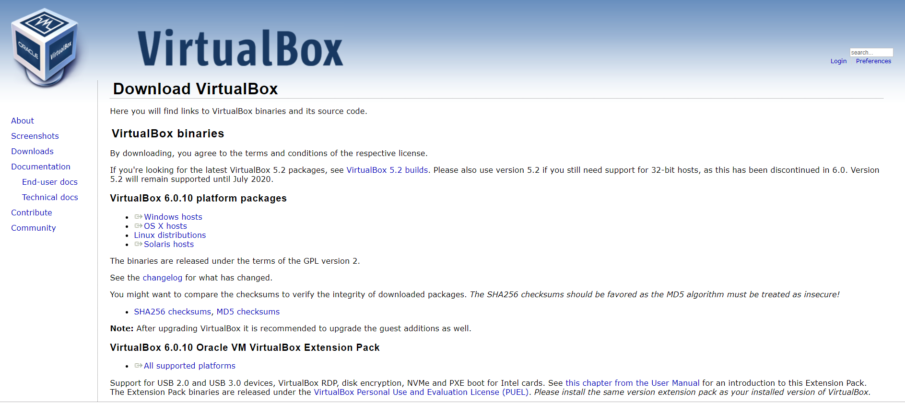
- 设置虚拟机端口，如下图，端口用于之后远程主机通过`宿主机IP地址+子虚拟机端口`访问，如`192.168.100.1:5001`
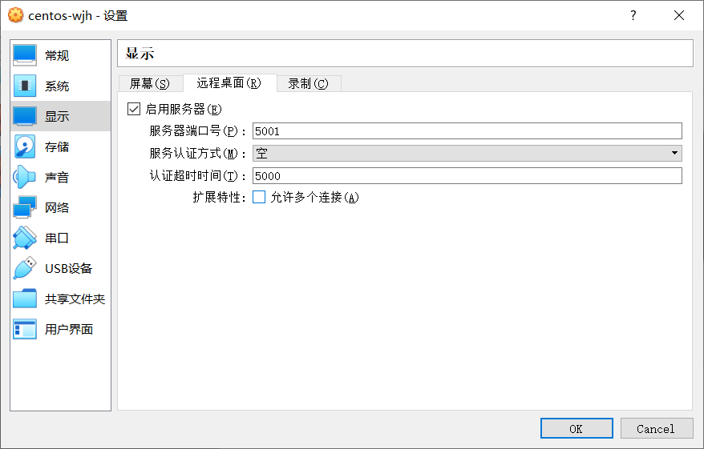
- 使用Windows`远程桌面连接`输入地址后成功访问虚拟机
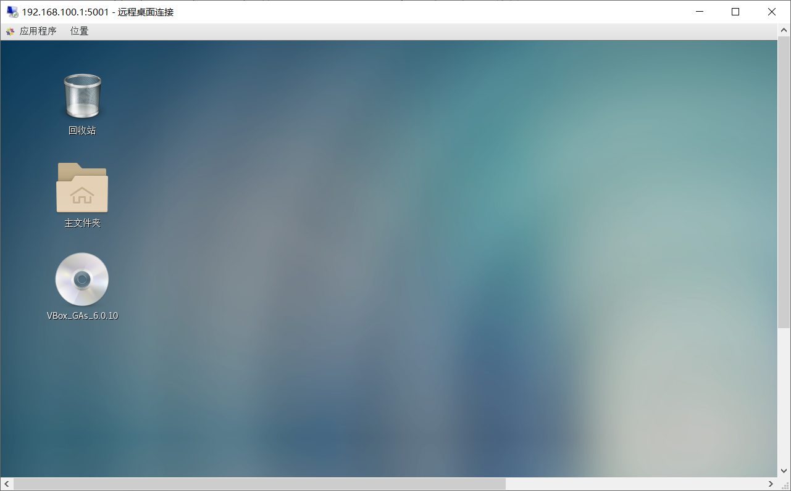

## 四、实验遇到的问题及感想

## 五、参考链接
1. 虚拟机无法联网，报错`Could not retrieve mirrorlist`，解决方法：
[https://www.cnblogs.com/xixihuang/p/5404517.html](https://www.cnblogs.com/xixihuang/p/5404517.html)
2. yum源配置为阿里云源的方法  
[https://www.cnblogs.com/yangp/p/8506264.html](https://www.cnblogs.com/yangp/p/8506264.html)
2. 安装VirtualBox虚拟机CentOS增强功能
[https://www.jianshu.com/p/7c556c783bb2](https://www.jianshu.com/p/7c556c783bb2)
4. CentOS7下安装Google Chrome浏览器遇到的问题及解决方法
[https://blog.csdn.net/u010454261/article/details/52833045](https://blog.csdn.net/u010454261/article/details/52833045)